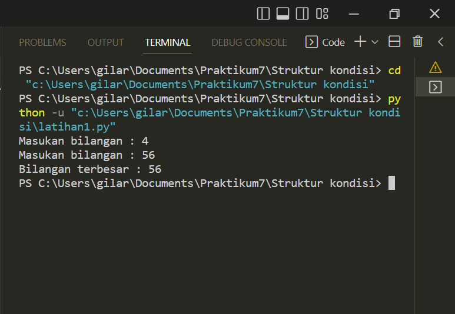
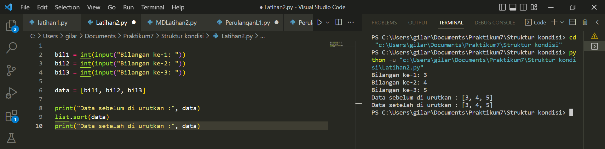

# Praktikum7

## Profil
| Variable | Isi |
| -------- | --- |
| **Nama** | Gilar Sumilar |
| **NIM** | 312210407 |
| **Kelas** | TI.22.A.4 |
| **Mata Kuliah** | Bahasa Pemrograman |

## Tugas struktur kondisi 
1. Latihan 1
*Buat program sederhada dengan input 2 buah bilangan, kemudian
 tentukan bilangan terbesar dari kedua bilangan tersebut
 menggunakan statement if.
 
 ```Python
#Masukan input 
bil1 = int (input("Masukan bilangan : "))
bil2 = int (input("Masukan bilangan : "))

#Nilai terbesar

if (bil1 > bil2):
    print("Bilangan terbesar :",bil1)

#Nilai terkecil

if (bil1 < bil2):
    print("Bilangan terbesar :",bil2)
```
## Hasil program


2. Latihan 2
*Buat program untuk mengurutkan data berdasarkan input sejumlah
 data (minimal 3 variable input atau lebih), kemudian tampilkan
 hasilnya secara berurutan mulai dari data terkecil.
 
 ```Python
#Masukan inputan
bil1 = int(input("Bilangan ke-1: "))
bil2 = int(input("Bilangan ke-2: "))
bil3 = int(input("Bilangan ke-3: "))

#Buat variable data
data = [bil1, bil2, bil3]

#Menampilkan data
print("Data sebelum di urutkan :", data)
list.sort(data)
print("Data setelah di urutkan :", data)
```

Code ini berfungsi untuk mengurutkan data
```Python
list.sort(data)
``` 

## Hasil program


## Tugas perulangan
1. Latihan 1
*Buat program dengan perulangan bertingkat (nested) for yang 
menghasilkan output sebagai berikut:

