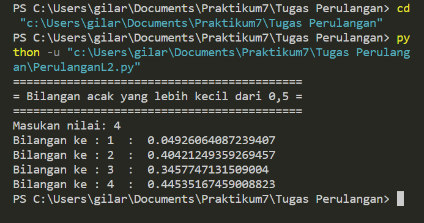
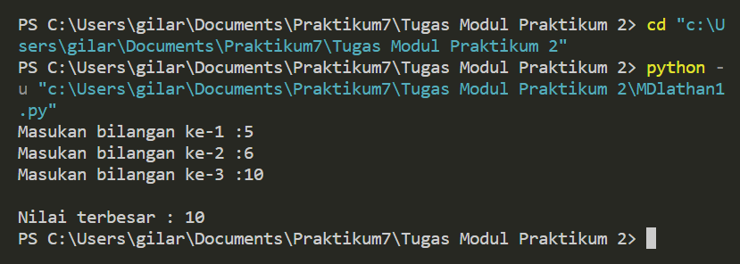
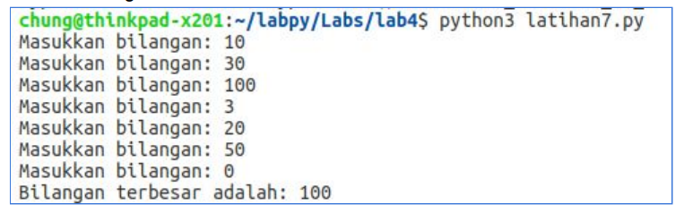
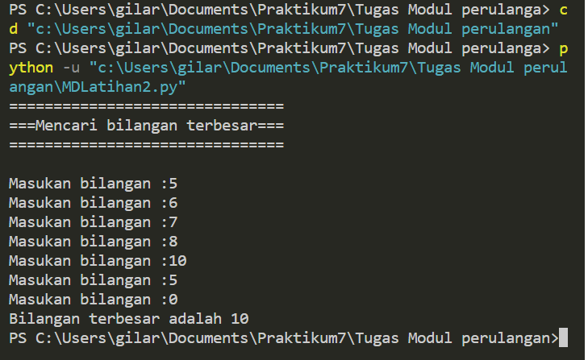
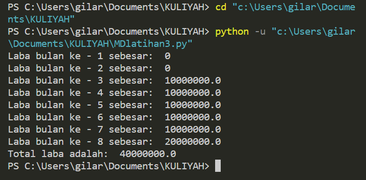

# Pertemuan-7

## Profil
| Variable | Isi |
| -------- | --- |
| **Nama** | Gilar Sumilar |
| **NIM** | 312210407 |
| **Kelas** | TI.22.A.4 |
| **Mata Kuliah** | Bahasa Pemrograman |

## Tugas struktur kondisi 
### Latihan 1

*Buat program sederhada dengan input 2 buah bilangan, kemudian
 tentukan bilangan terbesar dari kedua bilangan tersebut
 menggunakan statement if.*
 
 ```Python
#Masukan input 
bil1 = int (input("Masukan bilangan : "))
bil2 = int (input("Masukan bilangan : "))

#Nilai terbesar

if (bil1 > bil2):
    print("Bilangan terbesar :",bil1)

#Nilai terkecil

if (bil1 < bil2):
    print("Bilangan terbesar :",bil2)
```
#### Hasil program


### Latihan 2

*Buat program untuk mengurutkan data berdasarkan input sejumlah
 data (minimal 3 variable input atau lebih), kemudian tampilkan
 hasilnya secara berurutan mulai dari data terkecil.*
 
 ```Python
#Masukan inputan
bil1 = int(input("Bilangan ke-1: "))
bil2 = int(input("Bilangan ke-2: "))
bil3 = int(input("Bilangan ke-3: "))

#Buat variable data
data = [bil1, bil2, bil3]

#Menampilkan data
print("Data sebelum di urutkan :", data)
list.sort(data)
print("Data setelah di urutkan :", data)
```

`list.sort` Syntax ini berfungsi untuk mengurutkan data

#### Hasil program
 

## Tugas perulangan
### Latihan 1

*Buat program dengan perulangan bertingkat (nested) for yang 
menghasilkan output sebagai berikut:*

```Python
baris = 10
kolom = baris

for bar in range(baris):
    for col in range(kolom):
        tab = bar+col
        print("{0:>5}".format(tab), end='')
    print()
```

Penjelasan

1. Pendeklarasian variable
```python
baris = 10
kolom = baris
```

2. Untuk perulangan baris dan kolom menggunakan `for`
```python
for bar in range(baris):
    for col in range(kolom):
        tab = bar+col        
```
3. Untuk menampikan hasil dari perulangan
     * Agar terlihat rapih menggunakan `format string` rata ke kanan sebanyak 5 karakter
     * Agar tidak membuat baris baru menggunakan `end=''` (baris)
```python
  print("{0:>5}".format(tab), end='')
print()    
```
#### Hasil prgram
 

### Latihan 2

*Tampilkan n bilangan acak yang lebih kecil dari 0.5.* 
*nilai n diisi pada saat runtime*
*anda bisa menggunakan kombinasi while dan for untuk
 menyelesaikannya.*

```Python
import random
print("===========================================")
print("= Bilangan acak yang lebih kecil dari 0,5 =")
print("===========================================")

jum = int( input("Masukan nilai: "))
i = 0
while i in range(jum):
    i += 1
    angkarandom = random.uniform(0,0.5)
    print("Bilangan ke :", i, " : ", angkarandom)
```

#### Hasil program

- `import random` Untuk membuat bilangan acak
- `jum = int(input("Masukan nilai: "))` Menentukan jumlah input & di konversikan dalam bilangan bulat-dimasukan ke variable `jum`/jumlah
- `while i in range(jum)` Pengulangan
- Menampilkan urutan sesuai inputan dengan hasil di bawah 0.5
```python
angkarandom = random.uniform(0,0.5)
    print("Bilangan ke :", i, " : ", angkarandom)
```
## Tugas Modul praktikum 2
### Latihan 1

*Buat program sederhana dengan input tiga buah bilangan, dari ketiga bilangan
 tersebut tampilkan bilangan terbesarnya. Gunakan statement if.*
 
 ```Python
 
a = int(input("Masukan bilangan ke-1 :"))
b = int(input("Masukan bilangan ke-2 :"))
c = int(input("Masukan bilangan ke-3 :"))

max = a

if b > max:
    max = b

if c > max:
    max = c

print()
print("Nilai terbesar :", max)
```
Penjelasan
- a,b,c sebagai inputan 
- `max = a` Dekralasi variable
- `if` jika b lebih besar dari a/max, maka max = a
- `if` jika c lebih besar dari a/max, maka max = c

#### Hasil program


## Tugas Modul praktikum 3
### Latihan 1

*Buat program untuk menampilkan bilangan terbesar dari n buah data yang diinputkan.
 Masukkan angka 0 untuk berhenti.*



```Python
print("===============================")
print("===Mencari bilangan terbesar===")
print("===============================\n")

max = 0
while True:
    a = int(input("Masukan bilangan :"))
    if max < a:
        max = a
    if a == 0:
        break

print("Bilangan terbesar adalah :", max)
```
Penjelasan 
- `max = 0` Deklarasi variable
- `while True:` Perulangan tak terbatas
-  `a = int(input("Masukan bilangan :"))` Masukan inputan
-  Jika max kurang dari a maka max = a, maka variable max = atau nilai yg di inputkan
```Python
    if max < a:
        max = 0
    if a == 0:
        break
print("Bilangan terbesar adalah :", max)
```
- `print & max` Menampilkan bilangan 

#### Hasil program


### Latihan 2
*Buat program sederhana dengan perulangan: program1.py
Seorang pengusaha menginvestasikan uangnya untuk memulai usahanya dengan
modal awal 100 juta, pada bulan pertama dan kedua belum mendapatkan laba. pada
bulan ketiga baru mulai mendapatkan laba sebesar 1% dan pada bulan ke 5,
pendapatan meningkat 5%, selanjutnya pada bulan ke 8 mengalami penurunan
keuntungan sebesar 2%, sehingga laba menjadi 3%. Hitung total keuntungan selama 8
bulan berjalan usahanya.*

```Python
modal = 1000000000
pendapatan = 0

for i in range(1,9,1):
    if i < 3: 
        laba = 0
        pendapatan = pendapatan + laba
    elif i < 5:
        laba = modal * 0.01
        pendapatan = pendapatan + laba
    elif i < 8:
        laba + modal * 0.05
        pendapatan + pendapatan + laba
    else:
        laba = modal * 0.02
        pendapatan = pendapatan + laba
    print("Laba bulan ke -", i, "sebesar: ", laba)
print("Total laba adalah: ", pendapatan)
```
penjelasan 
- `if i in range(1,9,1)` untuk mendeklarasikan perulangan 1-9
- `if i < 3` jika i kurang dari bulan ke-3 maka laba/pendapatan = 0
- `if i < 5` jika i kurang dari bulan ke-5 maka laba/pendapatan = 0.01
- `if i < 8` jika i kurang dari bulan ke-8 maka laba/pendapatan = 0.05
- `else:` laba bulan terakhir = 0.02
- Menampilkan perulangan `i` pendapata/laba 
```Python
    print("Laba bulan ke -", i, "sebesar: ", laba)
print("Total laba adalah: ", pendapatan)
```

#### Hasil program 


# Selesai :)


